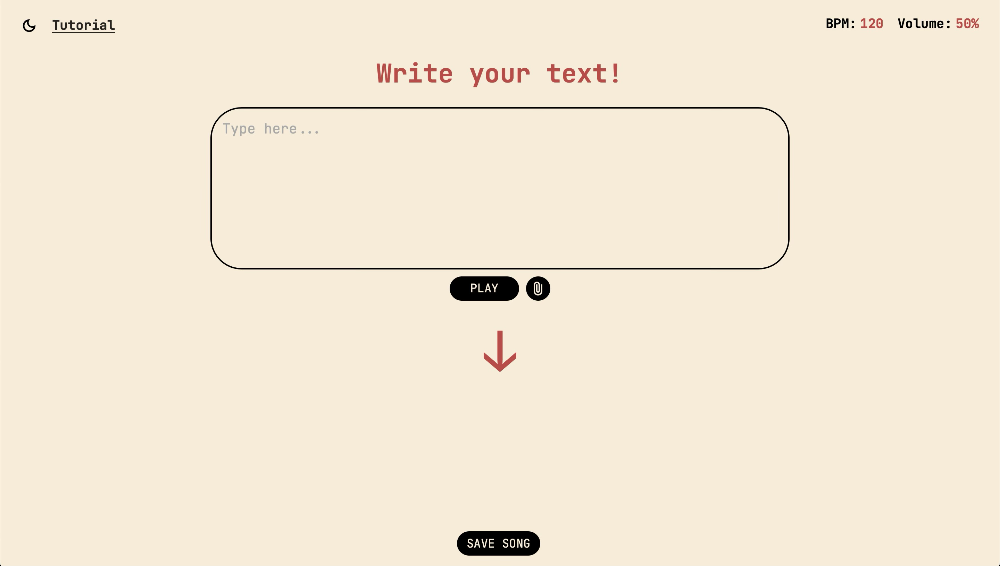
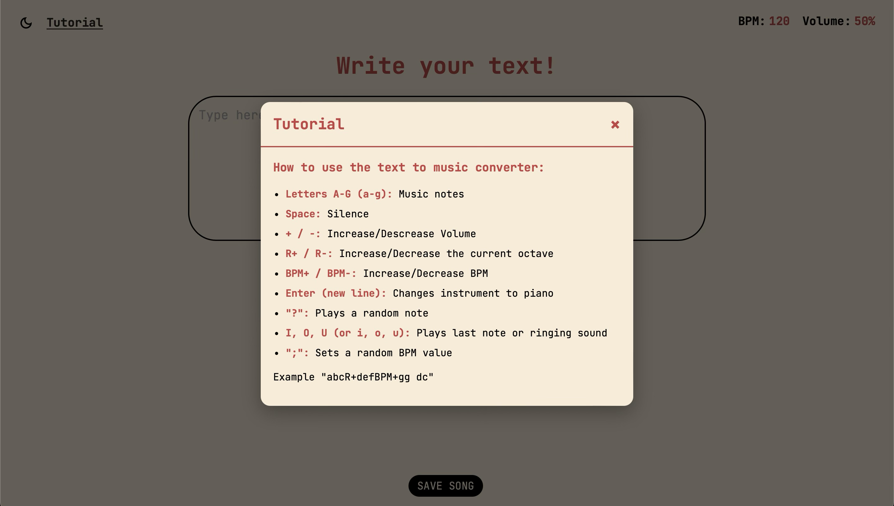
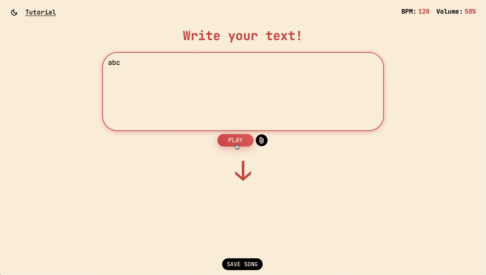
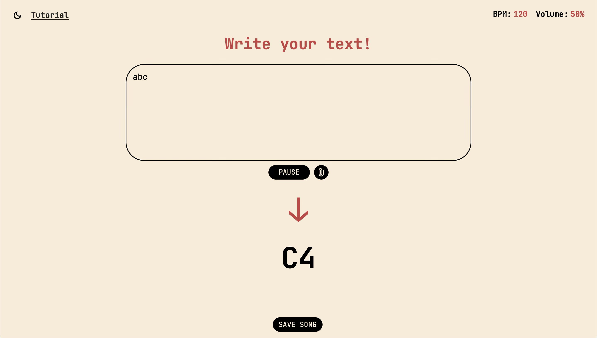
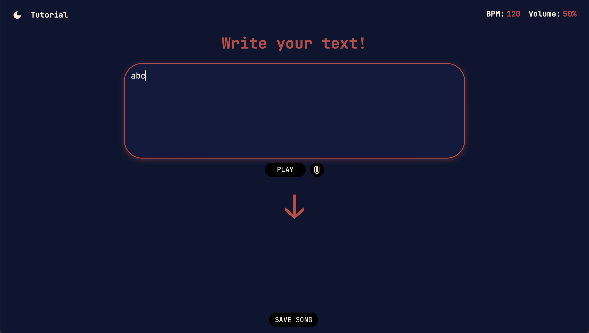

# TextToSound

## Sobre o Projeto

TextToSound é uma aplicação web que converte texto em música, transformando caracteres em comandos e notas musicais de forma interativa. Esse projeto foi construído para um trabalho da disciplina de Técnicas de Construção de Programas.

## Funcionalidades

- Conversão de texto para notas musicais
- Interface moderna e intuitiva
- Exportação de arquivos MIDI
- Tutorial interativo
- Controle de volume e BPM

## Screenshots

## Como Usar

1. Digite ou cole seu texto na área de entrada. Você também pode realizar o upload de um aquivo TXT.
2. Clique em "Play" para ouvir a música gerada.
3. Se quiser, exporte a música gerada como arquivo MIDI
4. Para conhecer todo o mapeamento dos caracteres, clique no botão de tutorial na parte superior da página.

## Tecnologias

- HTML
- CSS
- JavaScript
- Web Audio API
- Soundfont-Player
- MIDI.js